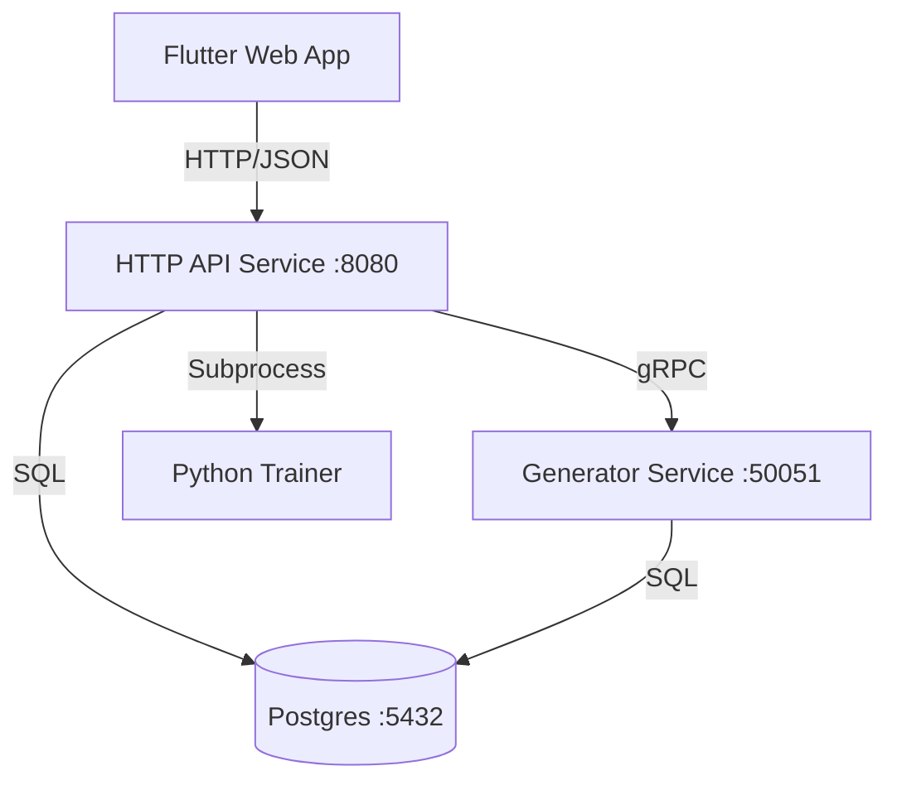

# Telemetry Anomaly Detection System (TADS)

A high-performance, full-stack anomaly detection system capable of generating synthetic telemetry, training PCA models properly, and performing real-time inference with alerts.

## Architecture



The system is decomposed into five core components:

1.  **HTTP API (C++)**: Orchestrator and BFF (Backend for Frontend). Exposes REST endpoints, calls the gRPC generator, and serves the static **Flutter Web** assets.
2.  **Generator (C++)**: High-throughput producer for synthetic data. Exposes a gRPC interface.
3.  **Database (PostgreSQL)**: Central store for telemetry, runs, models, and alerts.
4.  **Training (Python)**: PCA training logic invoked by the API server as a subprocess.
5.  **Management Plane (Dart)**: Unified logic across the **Flutter Web Dashboard** and the **Dart CLI Tool** for system orchestration and verification.

## Build Instructions

### Prerequisites
- C++20 Compiler (clang/gcc)
- CMake 3.15+
- PostgreSQL (libpqxx)
- gRPC & Protobuf
- Eigen3, nlohmann/json, spdlog, fmt

### Building
```bash
mkdir build && cd build
cmake ..
make -j4
```

This produces:
- `telemetry-generator`: Data producer.
- `telemetry-scorer`: Real-time inference engine.
- `telemetry-benchmark`: Throughput testing tool.
- `unit_tests`: Test suite.

## Usage

### 1. Generate Data
Simulate hosts and write to DB:
```bash
./build/telemetry-generator --hosts 10 --duration 3600
```
This populates the `host_telemetry_archival` table.

### 2. Train Model
Train the PCA model on generated data:
```bash
cd python/training
pip install -r requirements.txt
python train_pca.py
```
Outputs `artifacts/pca/default/model.json`.

### 3. Run Scorer (Inference)
Run the scorer simulation loop (checks `artifacts/pca/default/model.json`):
```bash
./build/telemetry-scorer
```

**Sharding Support**:
To distribute load across multiple instances:
```bash
# Instance 1 (Shard 0 of 2)
./build/telemetry-scorer 0 2

# Instance 2 (Shard 1 of 2)
./build/telemetry-scorer 1 2
```

### 4. Benchmarking
Measure raw inference throughput:
```bash
./build/telemetry-benchmark 1000000
```
*Expected: >150k records/sec on modern hardware.*

## Testing
Run the comprehensive test suite (Unit + Parity):
```bash
./build/unit_tests
```

## Features
- **Deterministic**: Seeded generation for reproducible anomalies.
- **Parity**: Python training and C++ inference are bit-exact (verified via `tests/parity`).
- **Fusion**: Combines robust statistical checks (Z-score) with multivariate PCA reconstruction error.
- **Alert Management**: Includes anti-flapping (hysteresis) and storm-control (cooldown) logic.

## License
MIT