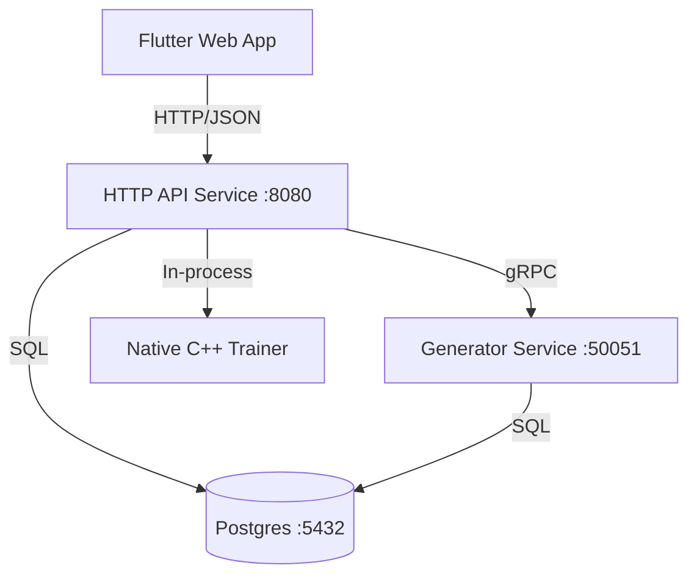

# Telemetry Anomaly Detection System (TADS)

A full-stack system for synthetic telemetry generation, PCA training, inference, and analytics with a Flutter web dashboard.

## Current Architecture



The system is decomposed into five core components:

1.  **HTTP API (C++)**: Orchestrator and BFF (Backend for Frontend). Exposes REST endpoints, calls the gRPC generator, and serves the static **Flutter Web** assets.
2.  **Generator (C++)**: High-throughput producer for synthetic data. Exposes a gRPC interface.
3.  **Database (PostgreSQL)**: Central store for telemetry, runs, models, and alerts.
4.  **Training (C++)**: PCA training logic invoked by the API server.
5.  **Management Plane (Dart)**: Unified logic across the **Flutter Web Dashboard** and the **Dart CLI Tool** for system orchestration and verification.

## Ports

- HTTP API: `8080`
- gRPC Generator: `50051`
- Postgres: `5432` (docker-compose.infra.yml maps host `5434 → 5432`)

## Repo Layout (Key Paths)

- `src/`: C++ API server, generator, training, inference
- `db/init.sql`: Fresh DB schema
- `db/migrations/`: Incremental schema migrations
- `web_ui/`: Flutter web dashboard
- `dart_cli/`: CLI client

## Build Instructions (Local)

### Prerequisites
- C++20 Compiler (clang/gcc)
- CMake 3.15+
- PostgreSQL (libpqxx)
- gRPC & Protobuf
- nlohmann/json, spdlog, fmt

### Building
```bash
mkdir build && cd build
cmake ..
make -j4
```

This produces:
- `telemetry-generator`: Data producer.
- `telemetry-scorer`: Real-time inference engine.
- `telemetry-benchmark`: Throughput testing tool.
- `unit_tests`: Test suite.
- `telemetry-api`: HTTP API server.

## Docker (Infra + Dev Container)

```bash
# Start Postgres
make infra-up

# Start dev container (build tools + source mounted)
make dev-up
```

Inside the dev container:
```bash
make build
./build/telemetry-generator   # gRPC generator
./build/telemetry-api         # HTTP API
```

Note: `docker-compose.yml` builds the runtime image and starts the API server (CMD is `telemetry-api`). If you need both API and generator in Docker, run the generator separately or run both binaries in the dev container.

## Database Setup / Migration

- **Fresh DB**: `db/init.sql` is applied automatically by `docker-compose.infra.yml`.
- **Existing DB**: apply `db/migrations/20260127_add_analytics.sql` and `db/migrations/20260128_add_score_job_progress.sql`.

Example (docker):
```bash
docker exec -i telemetry_postgres psql -U postgres -d telemetry < db/migrations/20260127_add_analytics.sql
docker exec -i telemetry_postgres psql -U postgres -d telemetry < db/migrations/20260128_add_score_job_progress.sql
```

## Usage

### 1. Generate Data (CLI or API)
CLI (direct generator):
```bash
./build/telemetry-generator --hosts 10 --duration 3600
```
This populates the `host_telemetry_archival` table.

API:
```bash
curl -X POST http://localhost:8080/datasets -H 'Content-Type: application/json' -d '{"host_count": 10}'
```

### 2. Train Model (API or CLI)
Train the PCA model on generated data:
```bash
./build/telemetry-train-pca --dataset_id <RUN_ID> --db_conn "<DB_CONN_STR>" --output_dir artifacts/pca/default
```
Outputs `artifacts/pca/default/model.json`.

API:
```bash
curl -X POST http://localhost:8080/train -H 'Content-Type: application/json' -d '{"dataset_id":"<RUN_ID>","name":"pca_v1"}'
```

### 3. Run Scorer (Inference)
Run the scorer simulation loop (checks `artifacts/pca/default/model.json`):
```bash
./build/telemetry-scorer
```

**Sharding Support**:
To distribute load across multiple instances:
```bash
# Instance 1 (Shard 0 of 2)
./build/telemetry-scorer 0 2

# Instance 2 (Shard 1 of 2)
./build/telemetry-scorer 1 2
```

### 4. Benchmarking
Measure raw inference throughput:
```bash
./build/telemetry-benchmark 1000000
```
*Expected: >150k records/sec on modern hardware.*

## HTTP API (Selected Endpoints)

### Navigation + Status
- `GET /datasets` (list runs)
- `GET /datasets/:id` (run detail)
- `GET /models` (list model runs)
- `GET /models/:id` (model detail + artifact summary)
- `GET /inference_runs` (list inference runs)
- `GET /inference_runs/:id` (inference detail)

### Core Actions
- `POST /datasets` (trigger data generation)
- `POST /train` (train model)
- `POST /inference` (score samples)

### Dataset Analytics
- `GET /datasets/:id/summary`
- `GET /datasets/:id/topk?column=region|project_id|host_id|anomaly_type`
- `GET /datasets/:id/timeseries?metrics=cpu_usage&aggs=mean&bucket=1h`
- `GET /datasets/:id/histogram?metric=cpu_usage&bins=40&range=minmax`

### Dataset-Wide Scoring + Eval
- `POST /jobs/score_dataset`
- `GET /jobs/:id`
- `GET /jobs/:id/progress`
- `GET /models/:id/eval?dataset_id=...`
- `GET /models/:id/error_distribution?dataset_id=...&group_by=anomaly_type|region|project_id`

## Flutter UI

Run in development:
```bash
cd web_ui
flutter pub get
flutter run -d chrome
```
Set the API base URL (default: http://localhost:8080):
```bash
flutter run -d chrome --dart-define=API_BASE_URL=http://localhost:8080
```

Tabs:
- Control (generate/train/infer)
- Runs
- Dataset Analytics
- Models (scoring job + eval)
- Inference History

## Testing
Run the comprehensive test suite (Unit + Parity):
```bash
./build/unit_tests
```

### Parity (C++-canonical golden regression)
Parity verifies that C++ inference matches committed golden artifacts. Goldens should only be updated when
the training output is intentionally changed and validated; otherwise, treat them as immutable regression baselines.

### Trainer Scale Validation
Use the PCA trainer CLI against an existing dataset to capture timing and row counts:
```bash
./build/telemetry-train-pca --dataset_id <RUN_ID> --db_conn "<DB_CONN_STR>" --output_dir artifacts/pca/default
```
The trainer emits:
- rows processed
- training time (seconds)
- artifact write time (seconds)
- artifact path
Compare results across dataset sizes to validate scale behavior.

## Features
- **Deterministic**: Seeded generation for reproducible anomalies.
- **Golden Regression**: C++ inference matches committed golden artifacts (verified via `tests/parity`).
- **Fusion**: Combines robust statistical checks (Z-score) with multivariate PCA reconstruction error.
- **Alert Management**: Includes anti-flapping (hysteresis) and storm-control (cooldown) logic.

## License
MIT
